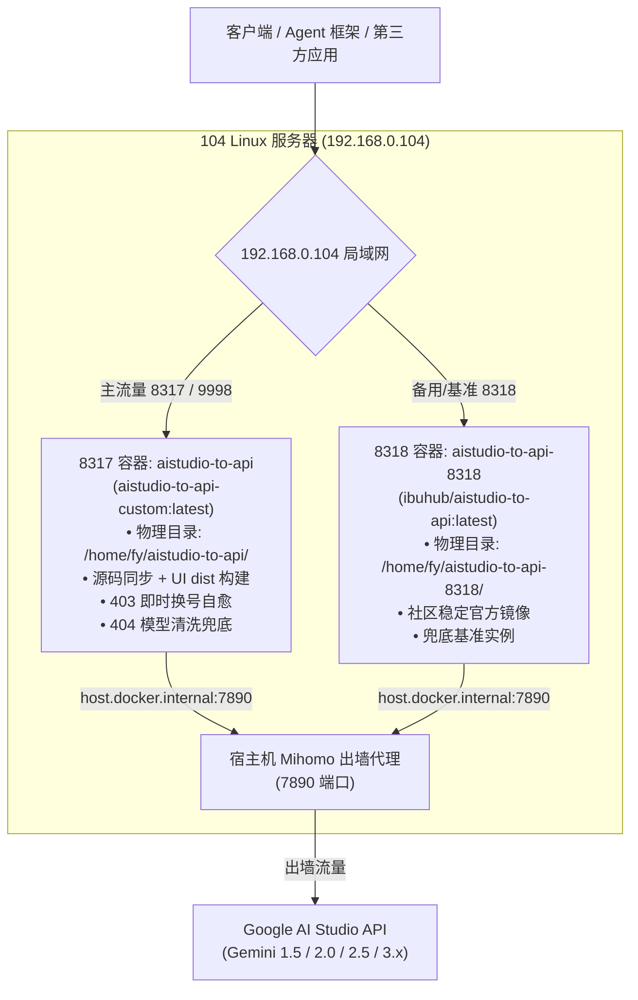
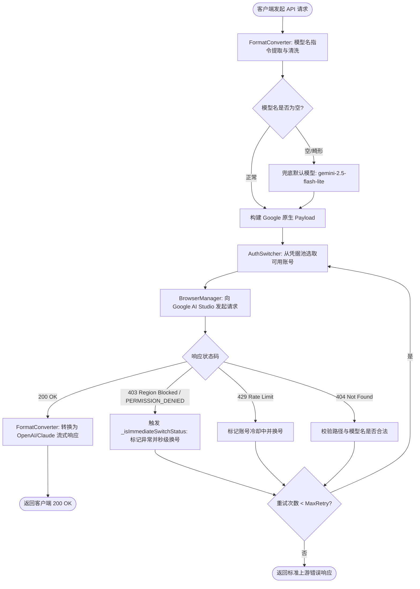

# Mermaid Architecture Diagrams: aistudio-to-api

> **[EVOLUTION_CONTRIBUTION]** (Phase 1 测算声明 / `00-evolution-law.md §1.6`)
> - $F_{System}$: **+** 架构图清晰展示双容器拓扑与 403/404 故障转移状态机，为系统运维提供精确视图。
> - $L_{User}$: **+** 消除多容器与多协议路由的理解歧义，降维认知负担。
> - $S_{total}$: **+** 集中收敛可视化图表至单文件，避免各规则与文档散乱冗余。
> - $Value_{Delivered}$: **+** 护航双容器网关稳定运行与快速接入。
> - `ect`: **S** (count(+)=4, count(-)=0, Value_Delivered=+, S_total=+)
> - `verdict`: **KEEP** (核心 memory-bank 资产)

## 1. 104 服务器双容器拓扑与出墙架构 (Dual-Container Topology)

---

## 2. 请求处理与 403/404 智能自愈状态机 (Request & Failover FSM)

(End of file - total 58 lines)
